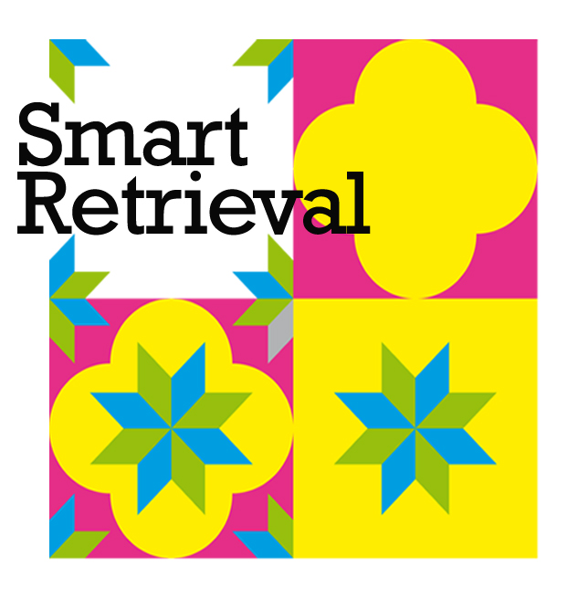

# ReInHerit Smart Retrieval Art Demo

This application is part of the **ReInHerit Toolkit**.




## Citation

If you use this software in your work please cite:

```
@inproceedings{HeriTech-2022,
	booktitle = {Communications in Computer and Information Science - Proc. of International Conference Florence Heri-tech: the Future of Heritage Science and Technologies},
	date-added = {2022-10-24 12:35:27 +0200},
	date-modified = {2023-04-04 15:39:10 +0200},
	doi = {https://doi.org/10.1007/978-3-031-20302-2_11},
	pages = {140--149},
	publisher = {Springer},
	title = {Exploiting {CLIP}-based Multi-modal Approach for Artwork Classification and Retrieval},
	volume = {1645},
	year = {2022},
	bdsk-url-1 = {https://doi.org/10.1007/978-3-031-20302-2_11}}
```


## Acknowledgements
This work was partially supported by the European Commission under European Horizon 2020 Programme, grant number 101004545 - [ReInHerit](https://www.reinherit.eu).
