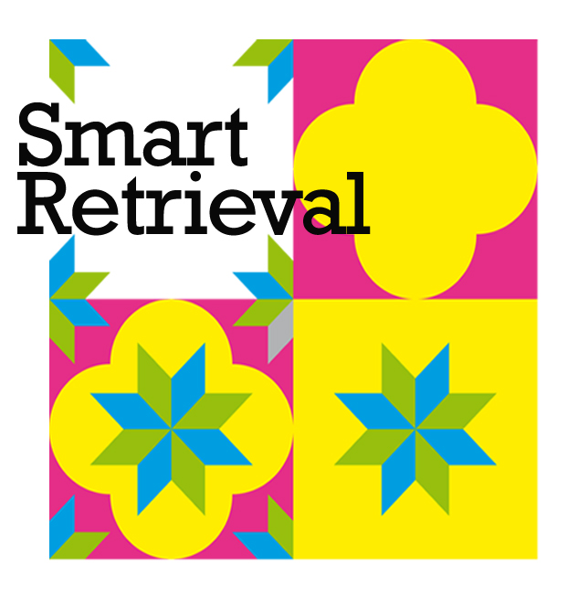
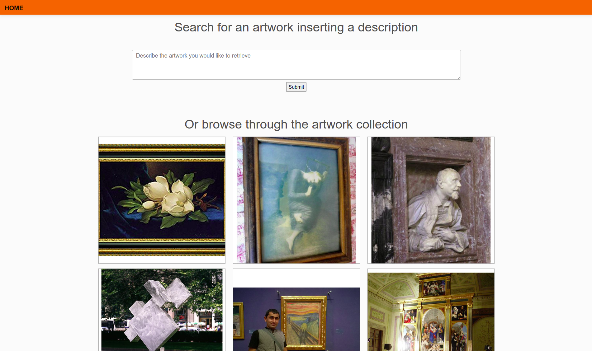
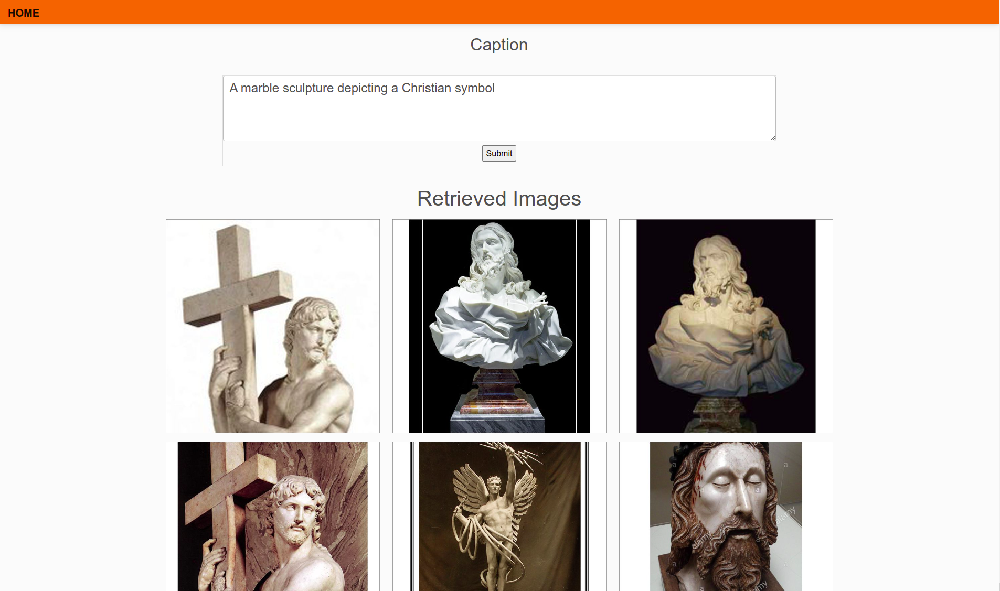
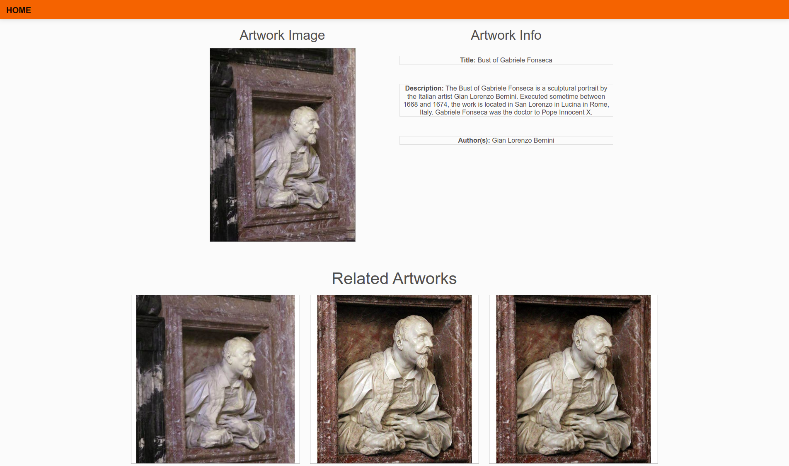

# ReInHerit Smart Retrieval Art Demo

This application is part of the **ReInHerit Toolkit**.



## Setting up using Docker

TBA

## Setting up using CONDA

## Table of Contents
* [About the Project](#about-the-project)
  * [Built With](#built-with)
* [Getting Started](#getting-started)
  * [Prerequisites](#prerequisites)
  * [Installation](#installation)
* [Usage](#usage)
  * [Data Preparation](#data-preparation)
  * [Feature Extraction](#feature-extraction)
  * [Run the Demo](#run-the-demo)
* [Demo Overview](#demo-overview)
* [Authors](#authors)
* [Acknowledgements](#acknowledgements)


## About The Project
This application is part of the **ReInHerit Toolkit**, implementing the system presented in the paper reported in the biblio.
It shows how to implement smart retreival using image-to-image and text-to-image retrieval in the Cultural Heritage domain.
The dataset used is [NoisyArt](https://github.com/delchiaro/NoisyArt), a dataset designed for webly-supervised recognition of artworks, considering multi-modality learning and zero-shot learning. 
The dataset consists of more than 80'000 webly-supervised images from 3120 classes, and a subset of 200 classes with more than 1300 verified images. 

### Built With
* [Python](https://www.python.org/)
* [PyTorch](https://pytorch.org/)
* [Torchvision](https://pytorch.org/vision/stable/index.html)
* [CLIP](https://github.com/openai/CLIP)
* [Flask](https://flask.palletsprojects.com/en/2.0.x/)
* [Bootstrap](https://getbootstrap.com/)


## Getting Started

To get a local copy up and running follow these simple steps.

### Prerequisites

We strongly recommend the use of the [**Anaconda**](https://www.anaconda.com/) package manager in order to avoid dependency/reproducibility problems.
A conda installation guide for linux systems can be found [here](https://docs.conda.io/projects/conda/en/latest/user-guide/install/linux.html)

### Installation
 
1. Clone the repo
```sh
git clone https://github.com/ReInHerit/SmartRetrievalArtDemo insert repo url
```
2. Install Python dependencies
```sh
conda create -n clip4art -y python=3.8
conda activate clip4art
conda install -y -c pytorch pytorch=1.7.1 torchvision=0.8.2
pip install flask==2.0.2
pip install git+https://github.com/openai/CLIP.git
```
3. Download [**NoisyArt**](https://github.com/delchiaro/NoisyArt) dataset
## Usage
Here's a brief description of each and every file and folder in the repo:

* ```utils.py```: Utils file
* ```data_utils.py```: Dataset loading and preprocessing utils file
* ```extract_features.py```: Feature extraction file
* ```app.py```: Flask server file
* ```static```: Flask static files folder
* ```templates```: Flask templates folder

### Data Preparation
To properly work with the codebase [**NoisyArt**](https://github.com/delchiaro/NoisyArt) dataset should have the following structure:

```
project_base_path
└───  noisyart_dataset
      └─── noisyart
            | metadata.json
            └───  splits
                  └───  trainval_3120
                        | boot.txt
                        | train.txt
                        | trainval.txt
                        | val.txt
            
      └───  trainval_3120
            └─── 0000_http:^^dbpedia.org^resource^'X'_Intertwining
                    | google_000.jpg
                    | google_001.jpg
                    | ...
                    
            └─── 0001_http:^^dbpedia.org^resource^1618_in_art
                    | flickr_000.jpg
                    | flickr_001.jpg
                    | ...
                    
            └─── ...
          
      └─── trainval_200
             └─── 0015_http:^^dbpedia.org^resource^A_Converted_British_Family_Sheltering_a_Christian_Missionary_from_the_Persecution_of_the_Druids
                    | flickr_000.jpg
                    | flickr_001.jpg
                    | ...
                    
            └─── 0022_http:^^dbpedia.org^resource^A_Girl_Asleep
                    | flickr_000.jpg
                    | flickr_001.jpg
                    | ...
                    
            └─── ...
            
       └─── test_200
             └─── 0015_http:^^dbpedia.org^resource^A_Converted_British_Family_Sheltering_a_Christian_Missionary_from_the_Persecution_of_the_Druids
                    | 11263104_10152876313375669_7205129171364455318_n.jpg
                    | Afmolean1.jpg
                    | ...
                    
            └─── 0022_http:^^dbpedia.org^resource^A_Girl_Asleep
                    | 5th-vermeer-in-met-a.jpg
                    | A_Maid_Asleep_-_Painting_of_Vermeer,_with_frame.jpg
                    | ...
                    
            └─── ...
```

### Feature Extraction
Before launching the demo it is necessary to extract the features 
using the following command
```shell
python extract_features.py
```

### Run the Demo
Start the server and run the demo using the following command
```shell
python app.py
```
By default, the server run on port 5000 of localhost address: http://127.0.0.1:5000/


## Demo overview

[//]: # (* Initially choose the dataset you want to experience with. As the image )

[//]: # (shown by the image you can experience with CIRR dataset or FashionIQ dataset)

[//]: # ()
[//]: # (![]&#40;images/dataset_choice.png "Dataset choice"&#41;)

* Initially, users have the option to enter a description of the artwork they are seeking or select an image from their artwork collection.



* Once the users have entered the description of the artwork, they will be able to view the artworks that correspond with its description.



* When clicking on an artwork, the user will be able to see the artwork and the description of the artwork




## Authors
* [**Alberto Baldrati**](https://scholar.google.it/citations?hl=en&user=I1jaZecAAAAJ)
* [**Marco Bertini**](https://scholar.google.it/citations?user=SBm9ZpYAAAAJ&hl=en)
* [**Tiberio Uricchio**](https://scholar.google.it/citations?user=XHZLRdYAAAAJ&hl=en)
* [**Alberto Del Bimbo**](https://scholar.google.it/citations?user=bf2ZrFcAAAAJ&hl=en)

## Acknowledgements
This work was partially supported by the European Commission under European Horizon 2020 Programme, grant number 101004545 - ReInHerit.


## Citation

If you use this software in your work please cite:

```
@inproceedings{HeriTech-2022,
	booktitle = {Communications in Computer and Information Science - Proc. of International Conference Florence Heri-tech: the Future of Heritage Science and Technologies},
	date-added = {2022-10-24 12:35:27 +0200},
	date-modified = {2023-04-04 15:39:10 +0200},
	doi = {https://doi.org/10.1007/978-3-031-20302-2_11},
	pages = {140--149},
	publisher = {Springer},
	title = {Exploiting {CLIP}-based Multi-modal Approach for Artwork Classification and Retrieval},
	volume = {1645},
	year = {2022},
	bdsk-url-1 = {https://doi.org/10.1007/978-3-031-20302-2_11}}
```


## Acknowledgements
This work was partially supported by the European Commission under European Horizon 2020 Programme, grant number 101004545 - [ReInHerit](https://www.reinherit.eu).
